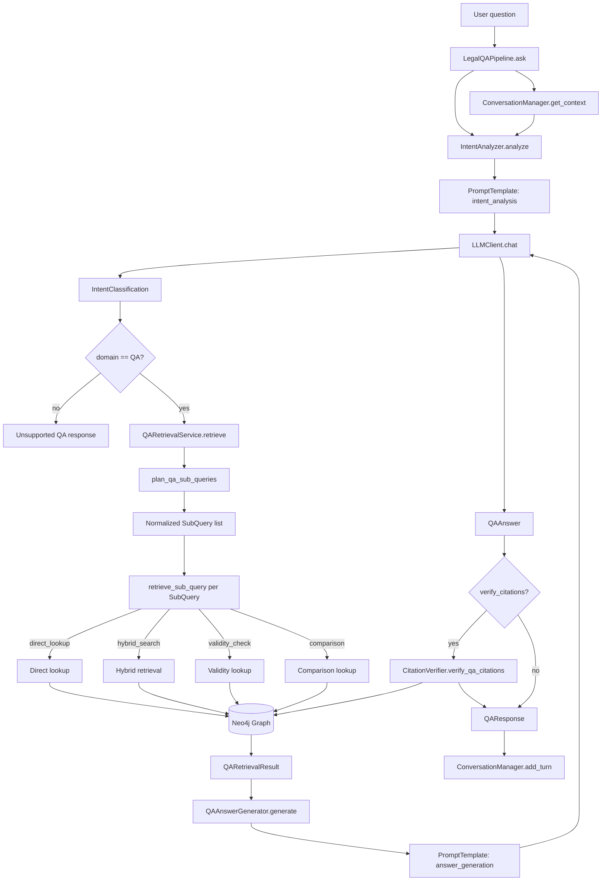
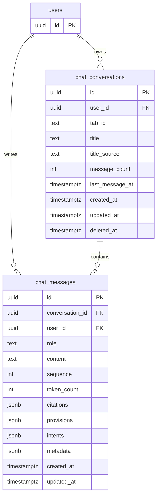
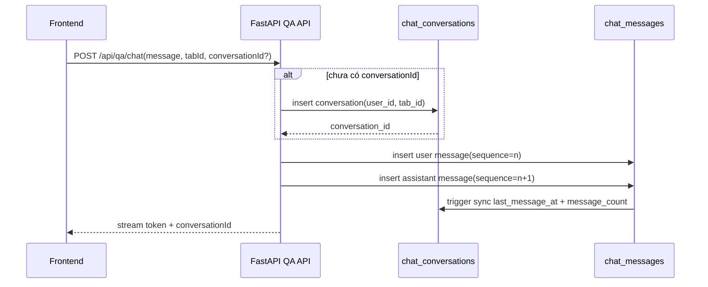
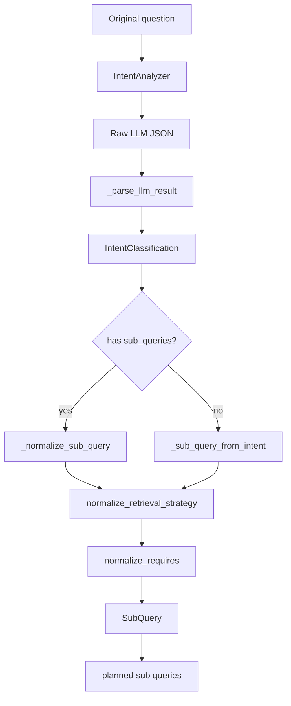
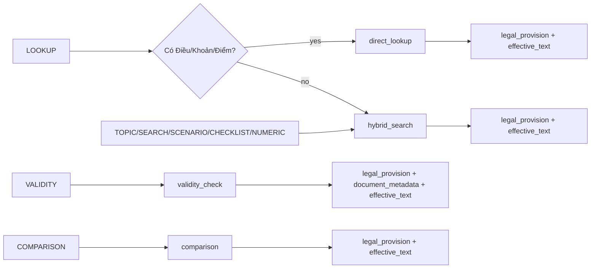
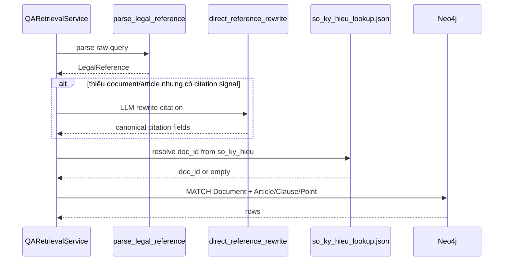
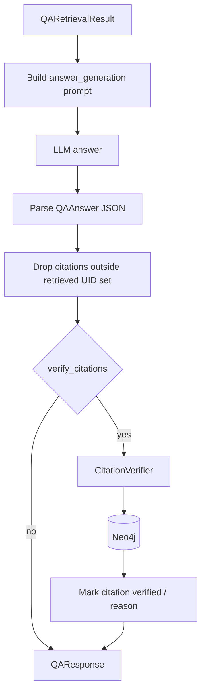

# QA Architecture

Tài liệu này mô tả luồng QA pháp lý đang được triển khai trong `src/llm`.
Entry point chính là `LegalQAPipeline.ask()` trong `src/llm/qa_pipeline.py`.

## Luồng tổng thể

## Kiến trúc database cho QA

Phần persist chat của Legal QA dùng Supabase Postgres làm source of truth. Migrations liên quan nằm ở:

- `infra/supabase/005_chat_conversations.sql`
- `infra/supabase/006_chat_messages.sql`

Thiết kế hiện tại tách làm 2 bảng:

- `chat_conversations`: metadata của một cuộc trò chuyện
- `chat_messages`: lịch sử message theo thứ tự trong từng conversation

Mục tiêu của thiết kế này là:

- mỗi user có nhiều conversation
- mỗi browser tab map tới tối đa một conversation đang active
- refresh cùng tab thì restore được conversation cũ
- lưu được toàn bộ assistant metadata để render lại UI
- hỗ trợ soft delete mà không xóa message vật lý

## Bảng `chat_conversations`

`chat_conversations` là aggregate root cho phần chat persistence. Mỗi row đại diện cho một thread hội thoại của một user.

Các cột chính:

- `id`: khóa chính UUID của conversation
- `user_id`: owner của conversation, tham chiếu `users(id)`
- `tab_id`: định danh tab phía frontend lưu trong `sessionStorage`
- `title`: tiêu đề hiển thị ở sidebar/dashboard
- `title_source`: nguồn title, hiện dùng `ai`, `manual`, `fallback`
- `message_count`: số message đã lưu trong conversation
- `last_message_at`: mốc thời gian message mới nhất để sort history
- `deleted_at`: dùng cho soft delete

Ràng buộc quan trọng:

- unique partial index trên `(user_id, tab_id)` khi `deleted_at IS NULL`
- điều này đảm bảo một user chỉ có một active conversation cho mỗi tab

Indexes chính:

- `idx_chat_conversations_user_last_message`: tối ưu list history theo `last_message_at DESC`
- `idx_chat_conversations_user_created`: hỗ trợ fallback sort theo thời điểm tạo
- `idx_chat_conversations_deleted_at`: hỗ trợ truy vấn audit hoặc dọn dữ liệu soft-deleted

## Bảng `chat_messages`

`chat_messages` lưu từng turn trong hội thoại. Một conversation có nhiều message, và message được đọc lại theo `sequence` hoặc `created_at`.

Các cột chính:

- `conversation_id`: tham chiếu tới conversation cha
- `user_id`: owner để backend luôn filter theo user
- `role`: `user`, `assistant`, hoặc `system`
- `content`: nội dung text đầy đủ của message
- `sequence`: thứ tự message trong cùng một conversation
- `token_count`: số token ước lượng hoặc thống kê cho message
- `citations`: JSONB citations của assistant
- `provisions`: JSONB legal provisions đã dùng để trả lời
- `intents`: JSONB intent classification cho câu trả lời
- `metadata`: JSONB mở rộng cho các field phụ trong tương lai

Ràng buộc và index:

- unique index trên `(conversation_id, sequence)` để tránh trùng thứ tự
- index theo `(conversation_id, created_at)` để load lịch sử chat nhanh
- index theo `(user_id, created_at)` để hỗ trợ truy vấn audit theo user
- GIN index trên `citations` và `provisions` để mở đường cho analytics/search sau này

## Lý do dùng JSONB cho metadata assistant

Assistant message hiện cần render lại nhiều metadata ngay trên UI:

- intent classification
- provisions trích dẫn
- citations đã verify hoặc chưa verify
- token usage

Thay vì tách ra nhiều bảng con, thiết kế hiện tại nhét `intents`, `provisions`, `citations`, `metadata` vào JSONB để:

- giảm số join khi load lại một conversation
- giữ nguyên shape object mà frontend đang dùng
- giúp việc replay chat đơn giản hơn

Trade-off là query phân tích theo chiều sâu relational sẽ khó hơn. Với bài toán hiện tại, chi phí đó chấp nhận được.

## Đồng bộ conversation sau khi insert message

Khi có row mới trong `chat_messages`, trigger `sync_chat_conversation_after_message()` sẽ update lại conversation cha:

- tăng `message_count`
- cập nhật `last_message_at`
- cập nhật `updated_at`

Điều này giữ cho list history không phải tự tính lại bằng aggregate query mỗi lần load sidebar hoặc dashboard.

## Mapping với frontend/backend hiện tại

Luồng ownership và restore đang hoạt động như sau:

- frontend tạo `tab_id` bằng `sessionStorage` trong `frontend/src/lib/chat-tab.ts`
- frontend gọi `GET /api/auth/backend-token` để lấy Bearer token cho FastAPI
- FastAPI xác định `user_id` từ token, không nhận `user_id` từ client
- `POST /api/qa/chat` tạo conversation nếu chưa có `conversationId`
- `GET /api/qa/conversations/tab/{tab_id}` dùng để restore conversation của tab hiện tại
- `GET /api/qa/conversations` dùng cho sidebar history và dashboard recent questions
- `DELETE /api/qa/conversations/{id}` chỉ set `deleted_at`

Điểm quan trọng là ownership luôn được enforce server-side bằng `user_id`, còn `tab_id` chỉ là khóa phụ để restore session theo tab.

## Soft delete và lifecycle

Conversation không bị hard delete ở flow thông thường. Khi user xóa history:

- `chat_conversations.deleted_at` được set
- conversation biến mất khỏi list thường
- `chat_messages` vẫn giữ nguyên để audit/debug

Thiết kế này phù hợp với các yêu cầu:

- an toàn hơn khi người dùng xóa nhầm
- không làm mất trace của assistant output
- đơn giản cho việc bổ sung restore hoặc admin tooling sau này

## Bảo mật và phạm vi hiện tại

Hiện tại RLS chưa được bật cho hai bảng chat. App đang dùng:

- Auth.js ở frontend để quản lý session
- backend token route để bridge auth sang FastAPI
- Supabase service role ở server side để đọc/ghi dữ liệu

Vì vậy, mọi query chat bắt buộc phải filter theo `user_id` ở backend. Đây là assumption quan trọng của kiến trúc hiện tại. Nếu sau này chuyển sang Supabase Auth JWT end-to-end thì có thể bật RLS và đẩy một phần ownership check xuống database.

## Planner và intent

`IntentAnalyzer` dùng prompt `intent_analysis` để trả về `IntentClassification`.
Output quan trọng gồm:

- `domain`: `QA`, `CONTRACT_REVIEW`, `CONTRACT_QA`, `EXPLAIN`, `CHITCHAT`
- `intents`: danh sách intent con như `LOOKUP`, `VALIDITY`, `COMPARISON`, `CHECKLIST`, `NUMERIC`, `TOPIC`, `SCENARIO`, `SEARCH`
- `sub_queries`: các truy vấn con đã có `retrieval_strategy` và `requires`
- `context_references`: thông tin lấy từ hội thoại trước
- `routing`: gợi ý pipeline chính/phụ

Nếu LLM không trả `sub_queries`, `qa_planner.py` tự sinh từ `intents`.
Nếu có `sub_queries`, planner vẫn normalize strategy và requirements để tránh giá trị lạ.

## Intent sang retrieval strategy

Planner hiện map intent sang retrieval như sau:

| Intent | Strategy chính | Điều kiện |
| --- | --- | --- |
| `LOOKUP` | `direct_lookup` hoặc `hybrid_search` | Dùng `direct_lookup` khi có tín hiệu Điều/Khoản/Điểm đủ rõ; nếu không thì `hybrid_search` |
| `TOPIC`, `SEARCH`, `SCENARIO`, `CHECKLIST`, `NUMERIC` | `hybrid_search` | Câu hỏi theo chủ đề, nghĩa vụ, mức phạt, thủ tục, quyền lợi |
| `VALIDITY` | `validity_check` | Câu hỏi về hiệu lực, còn áp dụng không, đúng luật không |
| `COMPARISON` | `comparison` | Câu hỏi so sánh nhiều văn bản/quy định |

Các `requires` chuẩn:

- `legal_provision`
- `effective_text`
- `document_metadata`
- `conversation_context`
- `contract_context`
- `citation_validation`
- `amendment_history`

Planner luôn bổ sung requirement mặc định. Ví dụ `direct_lookup` thường cần `legal_provision` và `effective_text`; `validity_check` cần thêm `document_metadata`.

## Direct lookup

`direct_lookup` không dùng semantic search. Nó cố parse citation rồi query Neo4j trực tiếp.

Các bước chính trong `QARetrievalService._direct_lookup()`:

1. `parse_legal_reference()` dùng regex lấy `article`, `clause`, `point`, `so_ky_hieu`, `year`, `document_hint`.
2. Nếu query có tín hiệu citation nhưng thiếu đủ thông tin, `_rewrite_direct_reference()` gọi prompt `direct_reference_rewrite`.
3. `_resolve_doc_id()` thử map `so_ky_hieu` qua `data/so_ky_hieu_lookup.json`.
4. Cypher match `Document` theo `doc_id`, `so_ky_hieu`, `normalized_so_ky_hieu`, hoặc `doc.title CONTAINS document_hint`.
5. Sau khi có `Document`, lookup `Article`, `Clause`, `Point` theo index/letter.

## Hybrid search

`hybrid_search` dùng `LegalHybridRetriever`.
QA layer tạo `LegalRetrievalPlan` từ sub-query, sau đó retriever kết hợp nhiều tín hiệu:

- query tự nhiên
- keyword/title hint/domain hint
- lexical/vector/graph score
- metadata của `Document`
- article/clause/point candidate

Kết quả được chuyển về `QARetrievedProvision` để answer generator dùng thống nhất với `direct_lookup`.

## Answer generation và citation verification

Sau retrieval, `QAAnswerGenerator` dựng prompt `answer_generation` với:

- câu hỏi gốc
- retrieved provisions
- effective text nếu có
- amendment history/validity signal nếu có

LLM phải trả JSON object. Generator chỉ giữ citation có UID nằm trong retrieved provisions. Nếu answer thiếu citation nhưng chỉ có một provision, generator tự gắn provision đó làm citation.

Nếu `verify_citations=True`, `CitationVerifier` verify citation bằng UID trước. Nếu không có UID, verifier parse citation text rồi lookup Neo4j.

## Các file chính

| File | Vai trò |
| --- | --- |
| `src/llm/qa_pipeline.py` | Orchestrator end-to-end |
| `src/llm/intent.py` | Gọi LLM phân tích intent và parse kết quả |
| `src/llm/qa_planner.py` | Normalize sub-query, strategy, requires |
| `src/llm/qa_retrieval.py` | Direct lookup, validity lookup, hybrid retrieval adapter |
| `src/llm/prompts.py` | Prompt `intent_analysis`, `direct_reference_rewrite`, `answer_generation` |
| `src/llm/answer_generator.py` | Sinh câu trả lời từ retrieved provisions |
| `src/llm/citation_verifier.py` | Verify citation bằng Neo4j |
| `src/llm/qa_models.py` | DTO cho retrieval result, answer, citation, validity |
| `src/llm/models.py` | DTO cho intent, sub-query, conversation context |

## Điểm cần lưu ý

`direct_lookup` phụ thuộc mạnh vào chất lượng graph và mapping ID. Nếu `Document` đúng nhưng chưa có `Article`, hoặc schema map nhầm `doc_id`, direct lookup sẽ không trả kết quả dù câu hỏi đúng.

`hybrid_search` phù hợp hơn cho câu hỏi không có citation cụ thể. Với câu như “người lao động được quyền gì khi thử việc”, planner nên đưa về `hybrid_search`, không ép `direct_lookup`.

`direct_reference_rewrite` chỉ được gọi khi parser thấy tín hiệu citation nhưng chưa đủ thông tin để direct lookup. Rewrite không được bịa citation ngoài input.
