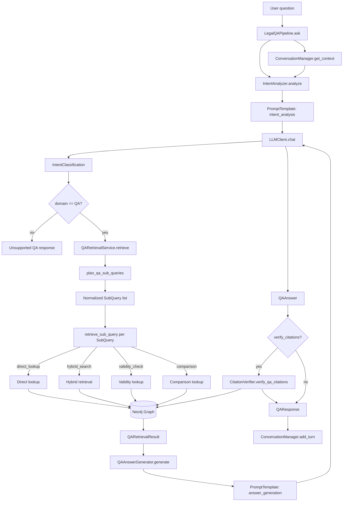
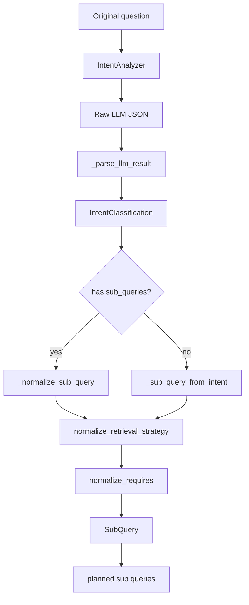
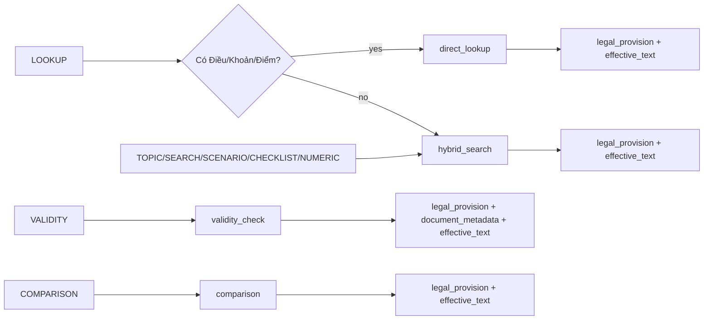
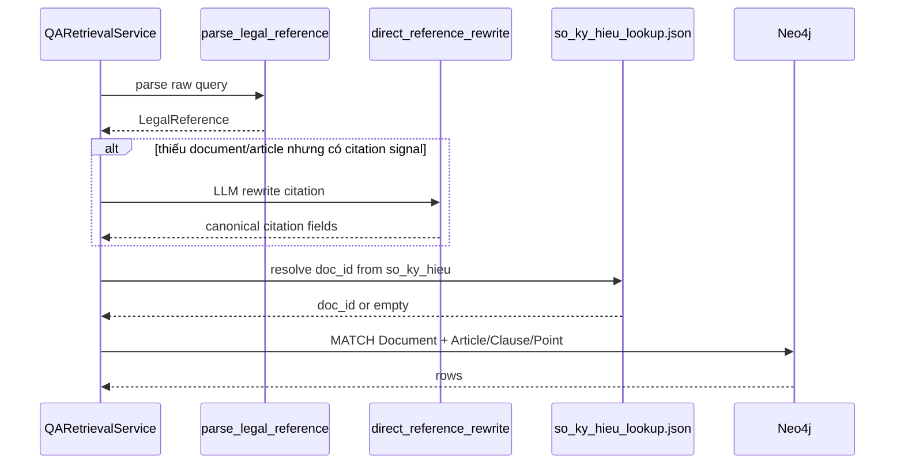
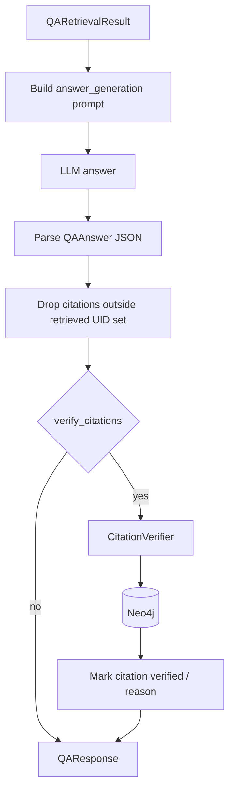

# QA Architecture

Tài liệu này mô tả luồng QA pháp lý đang được triển khai trong `src/llm`.
Entry point chính là `LegalQAPipeline.ask()` trong `src/llm/qa_pipeline.py`.

## Luồng tổng thể

## Planner và intent

`IntentAnalyzer` dùng prompt `intent_analysis` để trả về `IntentClassification`.
Output quan trọng gồm:

- `domain`: `QA`, `CONTRACT_REVIEW`, `CONTRACT_QA`, `EXPLAIN`, `CHITCHAT`
- `intents`: danh sách intent con như `LOOKUP`, `VALIDITY`, `COMPARISON`, `CHECKLIST`, `NUMERIC`, `TOPIC`, `SCENARIO`, `SEARCH`
- `sub_queries`: các truy vấn con đã có `retrieval_strategy` và `requires`
- `context_references`: thông tin lấy từ hội thoại trước
- `routing`: gợi ý pipeline chính/phụ

Nếu LLM không trả `sub_queries`, `qa_planner.py` tự sinh từ `intents`.
Nếu có `sub_queries`, planner vẫn normalize strategy và requirements để tránh giá trị lạ.

## Intent sang retrieval strategy

Planner hiện map intent sang retrieval như sau:

| Intent | Strategy chính | Điều kiện |
| --- | --- | --- |
| `LOOKUP` | `direct_lookup` hoặc `hybrid_search` | Dùng `direct_lookup` khi có tín hiệu Điều/Khoản/Điểm đủ rõ; nếu không thì `hybrid_search` |
| `TOPIC`, `SEARCH`, `SCENARIO`, `CHECKLIST`, `NUMERIC` | `hybrid_search` | Câu hỏi theo chủ đề, nghĩa vụ, mức phạt, thủ tục, quyền lợi |
| `VALIDITY` | `validity_check` | Câu hỏi về hiệu lực, còn áp dụng không, đúng luật không |
| `COMPARISON` | `comparison` | Câu hỏi so sánh nhiều văn bản/quy định |

Các `requires` chuẩn:

- `legal_provision`
- `effective_text`
- `document_metadata`
- `conversation_context`
- `contract_context`
- `citation_validation`
- `amendment_history`

Planner luôn bổ sung requirement mặc định. Ví dụ `direct_lookup` thường cần `legal_provision` và `effective_text`; `validity_check` cần thêm `document_metadata`.

## Direct lookup

`direct_lookup` không dùng semantic search. Nó cố parse citation rồi query Neo4j trực tiếp.

Các bước chính trong `QARetrievalService._direct_lookup()`:

1. `parse_legal_reference()` dùng regex lấy `article`, `clause`, `point`, `so_ky_hieu`, `year`, `document_hint`.
2. Nếu query có tín hiệu citation nhưng thiếu đủ thông tin, `_rewrite_direct_reference()` gọi prompt `direct_reference_rewrite`.
3. `_resolve_doc_id()` thử map `so_ky_hieu` qua `data/so_ky_hieu_lookup.json`.
4. Cypher match `Document` theo `doc_id`, `so_ky_hieu`, `normalized_so_ky_hieu`, hoặc `doc.title CONTAINS document_hint`.
5. Sau khi có `Document`, lookup `Article`, `Clause`, `Point` theo index/letter.

## Hybrid search

`hybrid_search` dùng `LegalHybridRetriever`.
QA layer tạo `LegalRetrievalPlan` từ sub-query, sau đó retriever kết hợp nhiều tín hiệu:

- query tự nhiên
- keyword/title hint/domain hint
- lexical/vector/graph score
- metadata của `Document`
- article/clause/point candidate

Kết quả được chuyển về `QARetrievedProvision` để answer generator dùng thống nhất với `direct_lookup`.

## Answer generation và citation verification

Sau retrieval, `QAAnswerGenerator` dựng prompt `answer_generation` với:

- câu hỏi gốc
- retrieved provisions
- effective text nếu có
- amendment history/validity signal nếu có

LLM phải trả JSON object. Generator chỉ giữ citation có UID nằm trong retrieved provisions. Nếu answer thiếu citation nhưng chỉ có một provision, generator tự gắn provision đó làm citation.

Nếu `verify_citations=True`, `CitationVerifier` verify citation bằng UID trước. Nếu không có UID, verifier parse citation text rồi lookup Neo4j.

## Các file chính

| File | Vai trò |
| --- | --- |
| `src/llm/qa_pipeline.py` | Orchestrator end-to-end |
| `src/llm/intent.py` | Gọi LLM phân tích intent và parse kết quả |
| `src/llm/qa_planner.py` | Normalize sub-query, strategy, requires |
| `src/llm/qa_retrieval.py` | Direct lookup, validity lookup, hybrid retrieval adapter |
| `src/llm/prompts.py` | Prompt `intent_analysis`, `direct_reference_rewrite`, `answer_generation` |
| `src/llm/answer_generator.py` | Sinh câu trả lời từ retrieved provisions |
| `src/llm/citation_verifier.py` | Verify citation bằng Neo4j |
| `src/llm/qa_models.py` | DTO cho retrieval result, answer, citation, validity |
| `src/llm/models.py` | DTO cho intent, sub-query, conversation context |

## Điểm cần lưu ý

`direct_lookup` phụ thuộc mạnh vào chất lượng graph và mapping ID. Nếu `Document` đúng nhưng chưa có `Article`, hoặc schema map nhầm `doc_id`, direct lookup sẽ không trả kết quả dù câu hỏi đúng.

`hybrid_search` phù hợp hơn cho câu hỏi không có citation cụ thể. Với câu như “người lao động được quyền gì khi thử việc”, planner nên đưa về `hybrid_search`, không ép `direct_lookup`.

`direct_reference_rewrite` chỉ được gọi khi parser thấy tín hiệu citation nhưng chưa đủ thông tin để direct lookup. Rewrite không được bịa citation ngoài input.
